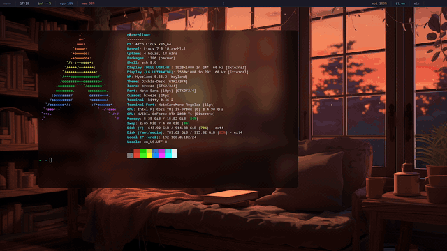

# Hyprland Config

A personal [Hyprland](https://hyprland.org) desktop setup with a custom [Quickshell](https://quickshell.outfoxxed.me/) shell - keyboard-driven, visually cohesive, and easy to tweak.



## Features

- **Quickshell bar** - modular panel with workspaces, system stats (CPU, memory, battery), clock, audio, network, Bluetooth, and system tray
- **Settings overlay** - press `Alt+S` to open a floating settings window with fuzzy search across wallpapers, color palettes, bar designs, layouts, and apps
- **12 color palettes** - Catppuccin, Tokyo Night, Gruvbox, Nord, Dracula, Rose Pine, One Dark, Everforest, Solarized, and more - switch on the fly
- **7 bar designs** - default, compact, islands (floating pills), bold, minimal, clean (sans-serif), and hacker
- **4 Hyprland layouts** - dwindle, master, spiral, and split - toggleable from settings
- **Wallpaper manager** - browse and apply wallpapers with smooth `awww` transitions, per-monitor support
- **App launcher** - browse and launch apps from the settings overlay
- **Bluetooth manager** - pair, connect, and disconnect devices from settings
- **Dual-monitor** - primary 1920x1080 (workspaces 1–5), ultrawide 2560x1080 (workspaces 6–9)
- **Lua config** - modern Hyprland Lua format with custom bezier animations, blur, shadows, and rounded corners

## Keybinds

| Key | Action |
|---|---|
| `Alt + Q` | Open terminal (kitty) |
| `Alt + Space` | Open app launcher (settings apps page) |
| `Alt + S` | Toggle settings overlay |
| `Alt + W` | Close window |
| `Alt + F` | Toggle fullscreen |
| `Alt + V` | Toggle float |
| `Alt + E` | File manager (dolphin) |
| `Alt + T` | Browser (firefox) |
| `Alt + Tab` | Cycle workspaces |
| `Alt + Shift + Tab` | Cycle workspaces backward |
| `Alt + 1–9 / 0` | Switch to workspace |
| `Alt + Shift + 1–9 / 0` | Move window to workspace |
| `Alt + Shift + C` | Region screenshot |

## Installation

```bash
git clone https://github.com/yourusername/hyprland-config.git
cd hyprland-config
./install.sh
```

This syncs configs for `hypr`, `dunst`, `kitty`, and `quickshell` to `~/.config/`. Use `--watch` to auto-reload on file changes:

```bash
./install.sh --watch
```

## Requirements

- [Hyprland](https://hyprland.org)
- [Quickshell](https://quickshell.outfoxxed.me/)

- [kitty](https://sw.kovidgoyal.net/kitty/)
- [dunst](https://dunst-project.org/)
- [awww](https://github.com/amarakon/awww) (wallpaper transitions)
- [hyprlock](https://github.com/hyprwm/hyprlock) / [hypridle](https://github.com/hyprwm/hypridle) (lockscreen + idle)
- [hyprshot](https://github.com/Gustash/hyprshot) (screenshots)
- [hyprpicker](https://github.com/hyprwm/hyprpicker) (color picker)
